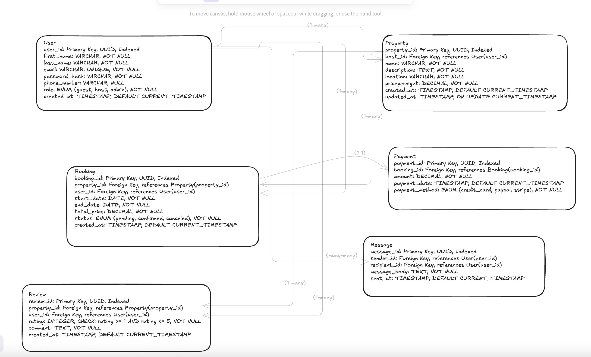

# Database Schema Requirements

This document outlines the database schema for a property rental platform. It includes five core entities: User, Property, Booking, Payment, Review, and Message.

---
## ERD

## User

Stores account details for guests, hosts, and admins.

| Field           | Type       | Constraints                          |
|----------------|------------|--------------------------------------|
| user_id        | UUID       | Primary Key, Indexed                 |
| first_name     | VARCHAR    | NOT NULL                             |
| last_name      | VARCHAR    | NOT NULL                             |
| email          | VARCHAR    | UNIQUE, NOT NULL                     |
| password_hash  | VARCHAR    | NOT NULL                             |
| phone_number   | VARCHAR    | NULL                                 |
| role           | ENUM       | NOT NULL (`guest`, `host`, `admin`) |
| created_at     | TIMESTAMP  | DEFAULT CURRENT_TIMESTAMP            |

---

## Property

Each property is listed by a host user.

| Field          | Type      | Constraints                         |
|----------------|-----------|-------------------------------------|
| property_id    | UUID      | Primary Key, Indexed                |
| host_id        | UUID      | Foreign Key → User(user_id)         |
| name           | VARCHAR   | NOT NULL                            |
| description    | TEXT      | NOT NULL                            |
| location       | VARCHAR   | NOT NULL                            |
| pricepernight  | DECIMAL   | NOT NULL                            |
| created_at     | TIMESTAMP | DEFAULT CURRENT_TIMESTAMP           |
| updated_at     | TIMESTAMP | ON UPDATE CURRENT_TIMESTAMP         |

---

## Booking

Links users to properties they have booked.

| Field        | Type      | Constraints                             |
|--------------|-----------|-----------------------------------------|
| booking_id   | UUID      | Primary Key, Indexed                    |
| property_id  | UUID      | Foreign Key → Property(property_id)     |
| user_id      | UUID      | Foreign Key → User(user_id)             |
| start_date   | DATE      | NOT NULL                                |
| end_date     | DATE      | NOT NULL                                |
| total_price  | DECIMAL   | NOT NULL                                |
| status       | ENUM      | NOT NULL (`pending`, `confirmed`, `canceled`) |
| created_at   | TIMESTAMP | DEFAULT CURRENT_TIMESTAMP               |

---

## Payment

Stores payment details for bookings.

| Field         | Type      | Constraints                                |
|---------------|-----------|--------------------------------------------|
| payment_id    | UUID      | Primary Key, Indexed                       |
| booking_id    | UUID      | Foreign Key → Booking(booking_id)          |
| amount        | DECIMAL   | NOT NULL                                   |
| payment_date  | TIMESTAMP | DEFAULT CURRENT_TIMESTAMP                  |
| payment_method| ENUM      | NOT NULL (`credit_card`, `paypal`, `stripe`) |

---

## Review

Users can leave reviews on properties they’ve booked.

| Field        | Type      | Constraints                               |
|--------------|-----------|-------------------------------------------|
| review_id    | UUID      | Primary Key, Indexed                      |
| property_id  | UUID      | Foreign Key → Property(property_id)       |
| user_id      | UUID      | Foreign Key → User(user_id)               |
| rating       | INTEGER   | NOT NULL, CHECK (rating between 1 and 5)  |
| comment      | TEXT      | NOT NULL                                  |
| created_at   | TIMESTAMP | DEFAULT CURRENT_TIMESTAMP                 |

---

## Message

Stores messages exchanged between users.

| Field         | Type      | Constraints                              |
|---------------|-----------|------------------------------------------|
| message_id    | UUID      | Primary Key, Indexed                     |
| sender_id     | UUID      | Foreign Key → User(user_id)              |
| recipient_id  | UUID      | Foreign Key → User(user_id)              |
| message_body  | TEXT      | NOT NULL                                 |
| sent_at       | TIMESTAMP | DEFAULT CURRENT_TIMESTAMP                |

---

## Relationships Summary

- **User ↔ Property:** 1:N (a host can own many properties)
- **User ↔ Booking:** 1:N (a user can make many bookings)
- **Property ↔ Booking:** 1:N (a property can have many bookings)
- **Booking ↔ Payment:** 1:1 (one payment per booking)
- **Property ↔ Review:** 1:N (a property can have many reviews)
- **User ↔ Review:** 1:N (a user can leave many reviews)
- **Message ↔ User:** N:1 for both `sender_id` and `recipient_id`. So a many to many relationship between the users sending multiple messages to each other

